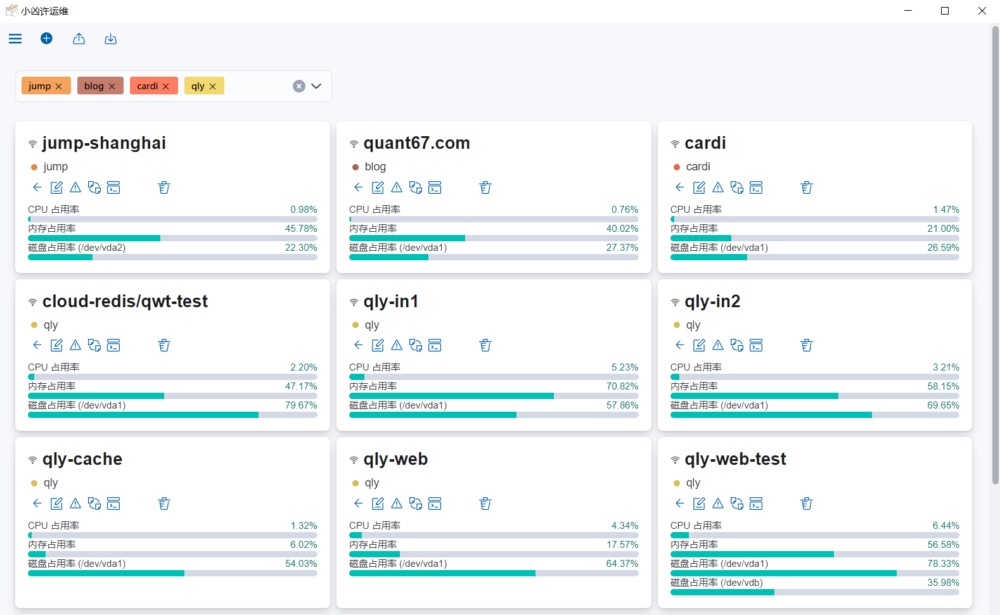

小凶许运维 - 服务器状态监控
---

小凶许运维是个简单服务器cpu/内存/磁盘占用情况实时监控程序。 
它的原理是 ssh 到服务器上，读取 /proc/* 文件夹的内容，显示在界面上。
如果超过某个设定的阈值就会发出邮件报警，邮件特别凶。
为了方便使用，集成了 ssh 终端功能。

主要是不会把数据上传，全都是本地 ssh 到自己服务器，不依赖三方服务器。
也不会在服务器上安装任何软件。

