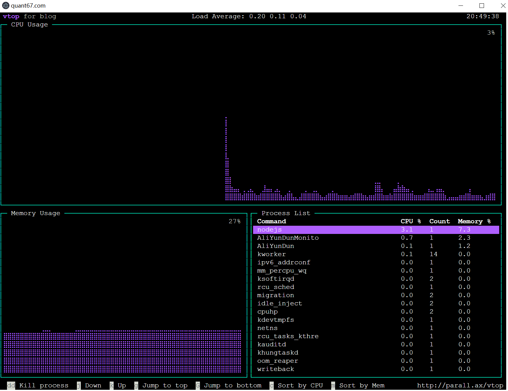
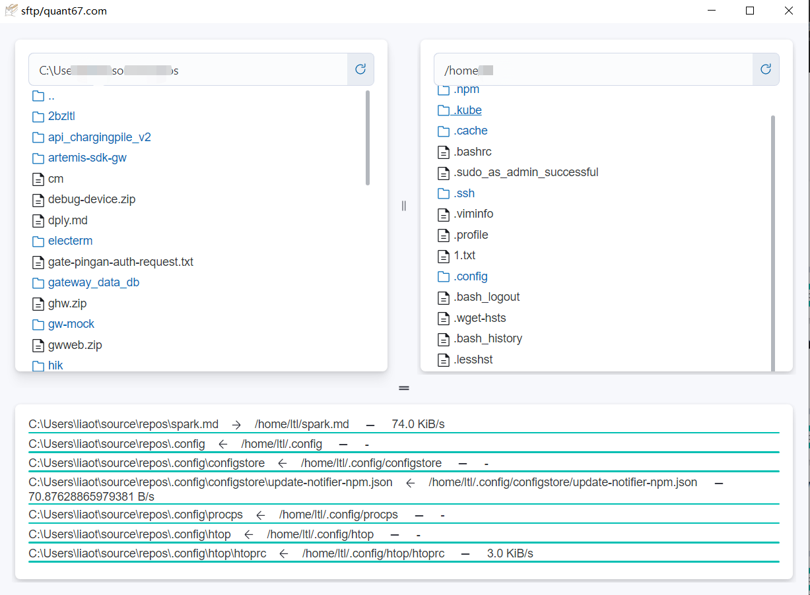

sguala - simple linux system monitor base on ssh
---

sguala is a simple system monitor that base on ssh.
It login to the remote linux server and cat /proc/* files,
then draw charts for it. It never sends any information to
any other location.

sguala also integrates a ssh terminal and sftp client.

