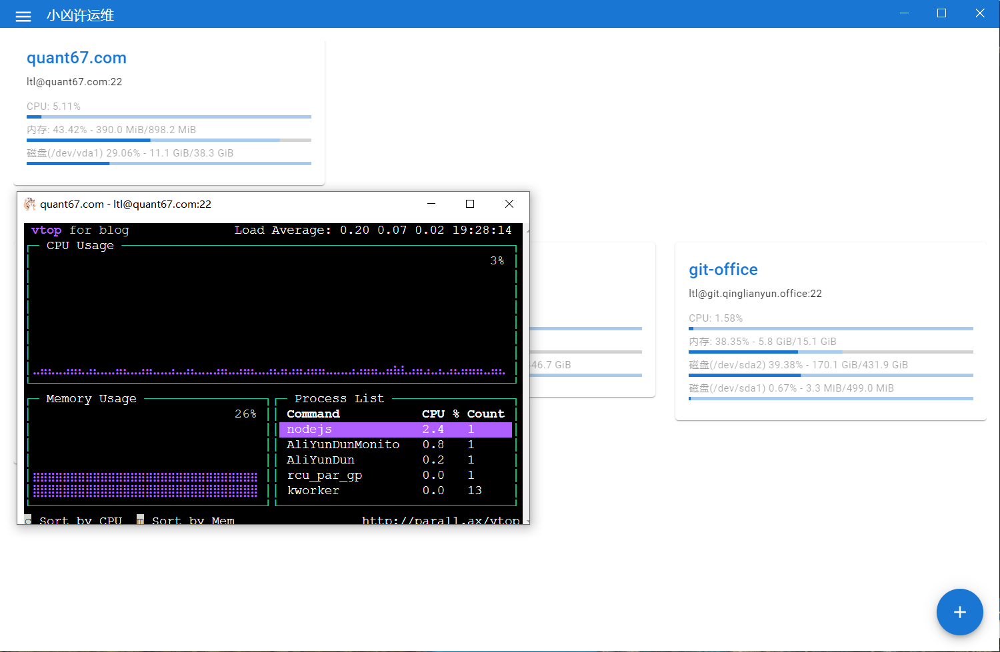

sguala - an monitor for your servers without agents
---

sguala is a simple monitor for your servers. It's written in electron so it's cross platform.
sguala can display the stats of your linux hosts. 



## CLI / TUI

An independent Go terminal client lives in [`cli/`](./cli/). It does not share runtime or config with the Electron app.

```bash
make -C cli build
./cli/bin/sguala init
./cli/bin/sguala
```

See [cli/README.md](./cli/README.md) for keys, config, and `sguala check`.

